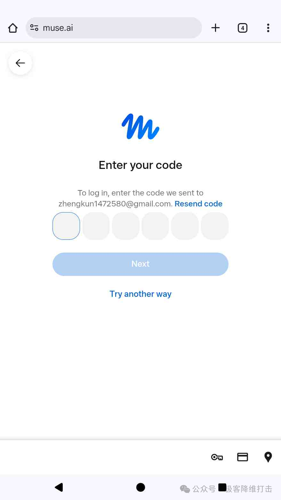
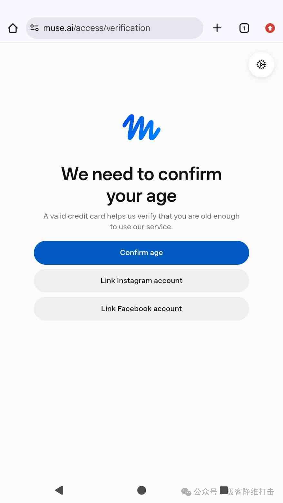
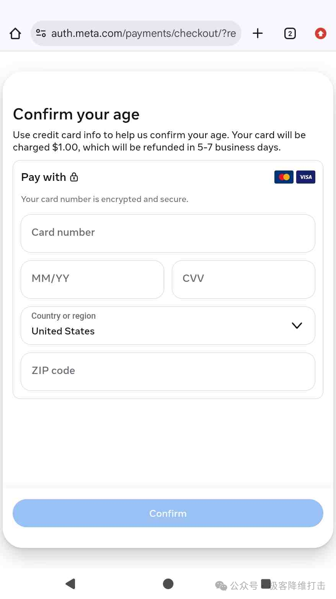
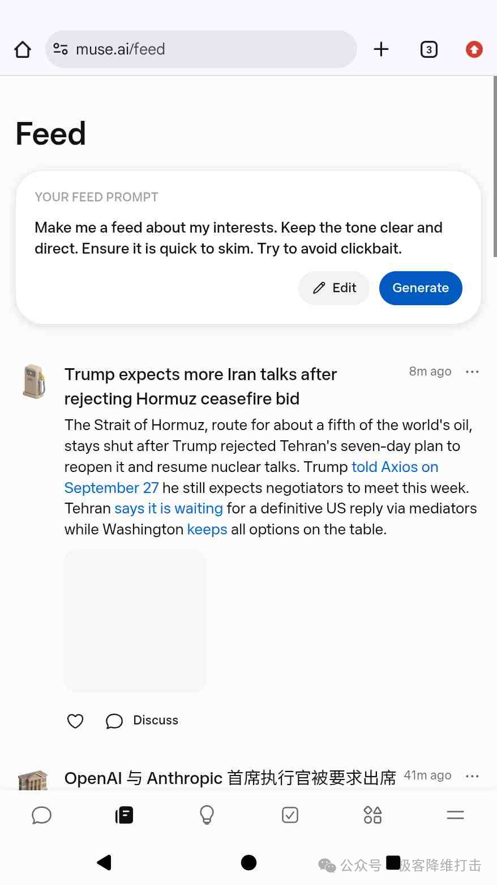
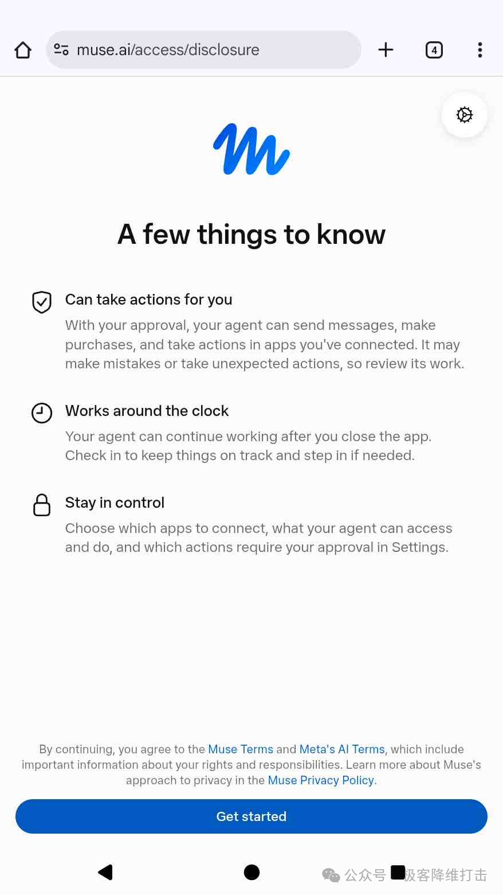

# Muse 注册与邀请码兑换

本指南整理 Muse 注册、年龄核验和邀请码兑换的常见步骤。页面选项、开放地区、奖励额度和规则可能变化，请以 Muse 官方页面与 App 当前显示为准。请使用真实信息，并遵守适用地区要求；不要伪造所在地或年龄来绕过限制。

## 注册流程

### 1. 打开注册页面

前往 [Muse 注册入口](https://muse.ai/join)，按页面提示开始注册。如果服务暂未向你开放，请按页面说明处理。

### 2. 验证邮箱

输入邮箱并获取验证码，查收邮件后填写验证码。不要把验证码交给他人。

### 3. 完成年龄核验

注册时可能需要年龄核验。可用选项因账号与地区而异，请只使用页面实际提供、且你愿意使用的方式。如果页面显示银行卡预授权或扣款，先确认金额、用途和退款条款。

### 4. 查看功能与权限说明

注册完成后，页面可能展示功能说明和权限选项。阅读权限及代理行为说明，确认理解后再继续。

### 5. 登录并开始使用

完成注册后，可在 Muse 网页或 App 登录账号。

## 兑换邀请码

加入后 **48 小时内**，打开 Muse App 的 **设置（Settings）**，找到邀请码兑换入口，输入下方邀请码并提交。菜单名称可能随版本变化；完成后确认 App 显示兑换成功。

**邀请码：`7F6MSA`**

该邀请码宣传奖励为双方各得 **10 亿 Token**，价值约 **200 美元**。最终额度、价值口径、有效期和名额以兑换页面显示为准。
